# LAB5 Javascript

<table border="2" cellpading="10">
  <tr>
    <td><b>Nama</b></td>
    <td>Ilham Nur Utomo</td>
  </tr>
  <tr>
    <td><b>NIM</b></td>
    <td>312010129</td>
  </tr>
  <tr>
    <td><b>Kelas</b></td>
    <td>TI.20.A1</td>
  </tr>
  <tr>
    <td><b>MataKuliah</b></td>
    <td>Pemrograman Web</td>
  </tr>
</table>

# <b>Praktikum</b>

## <b>1. Dokumen awal </b>
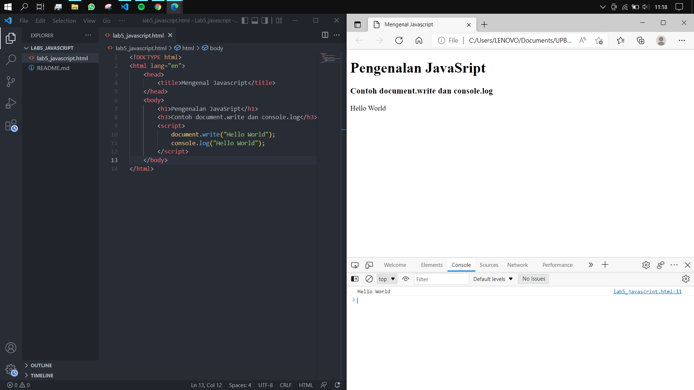 

## <b>2. Alert pada window </b>
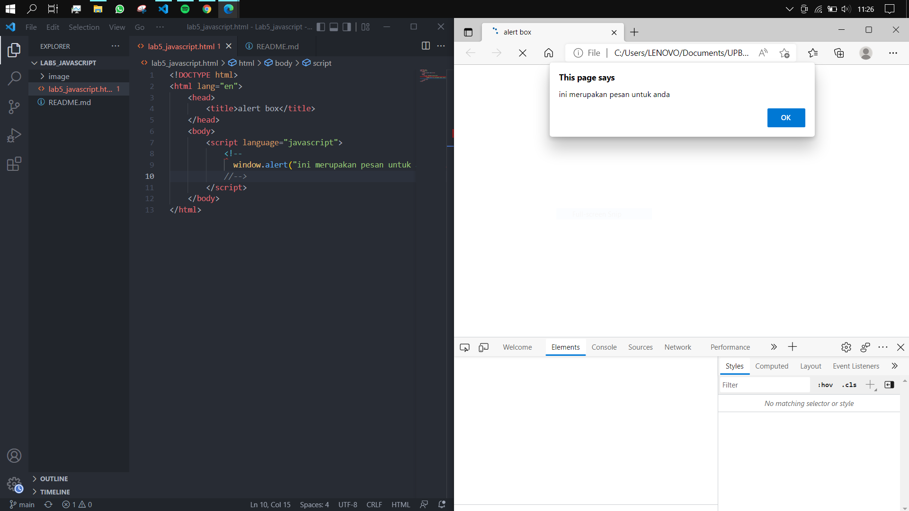 

## <b>3. Method dalam objek </b>
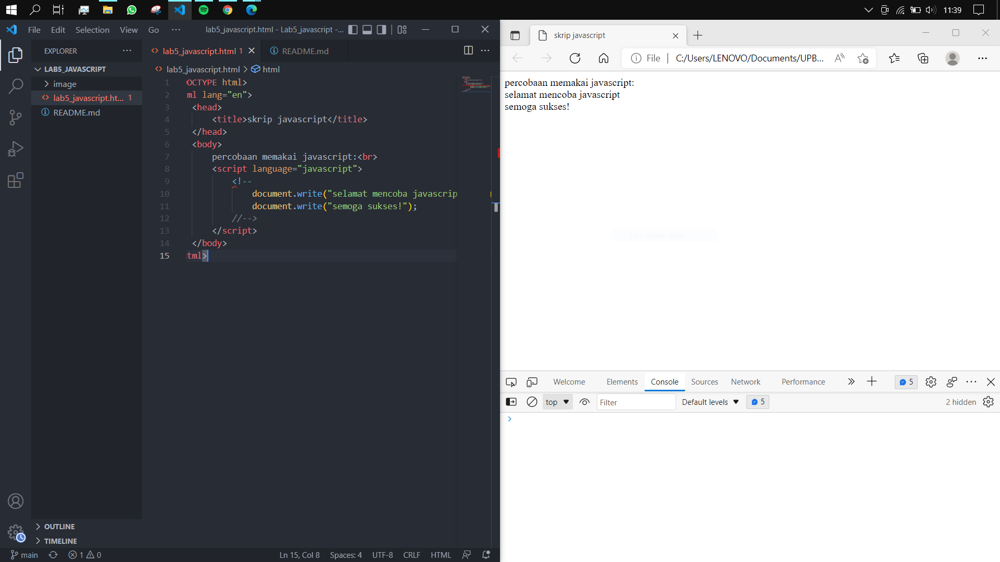 

## <b>4. Pemakaian prompt </b>
- Setelah dijalankan 
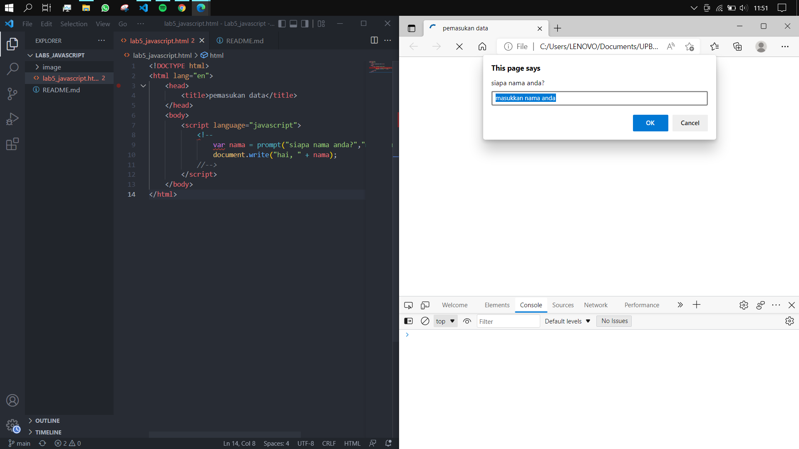 
- Ketika diinput 
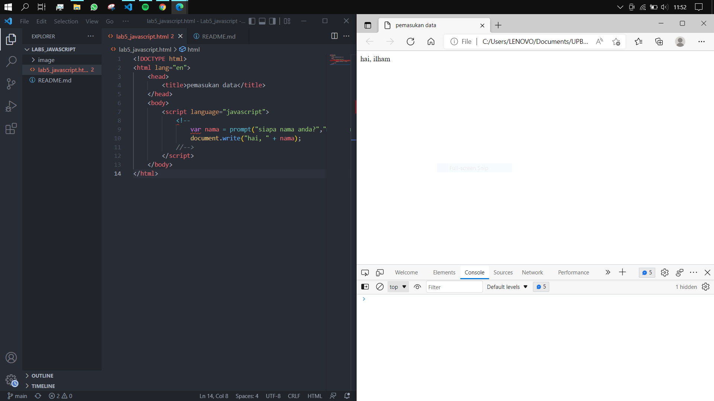 

## <b>5. Fungsi dan memanggilnya </b>
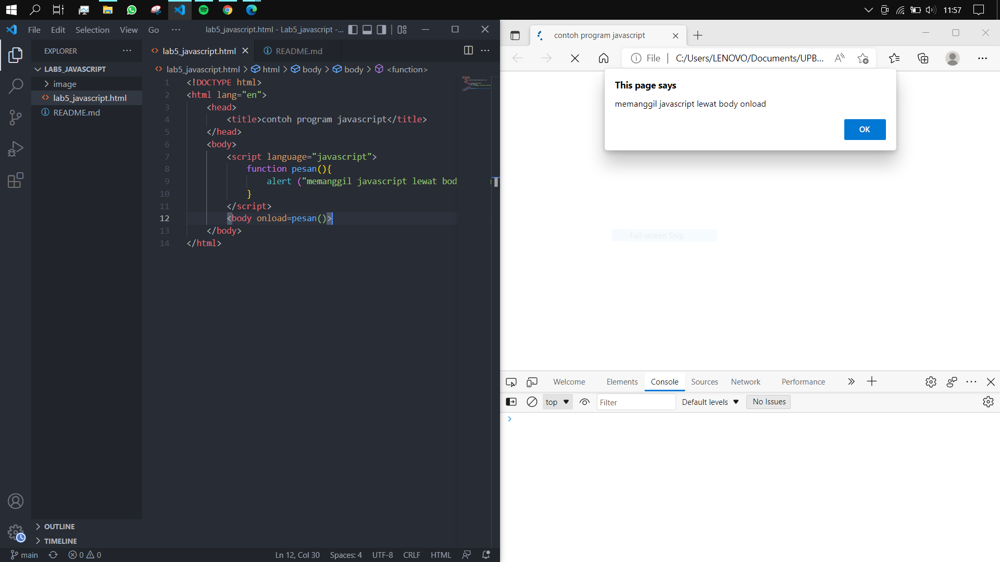 

## <b>6. Operasi dasar aritmatika </b>
 

## <b>7. Operasi dasar aritmatika </b>
- Setelah dijalankan 
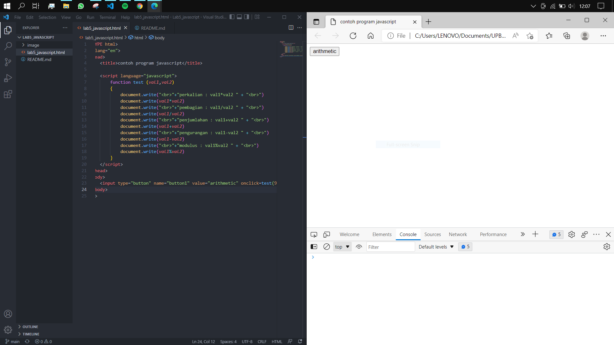 
- Ketika diklik, ini merupakan operasi dari bil 9 dan 4 
 

## <b>8. Seleksi kondisi </b>
- Setelah dijalankan 
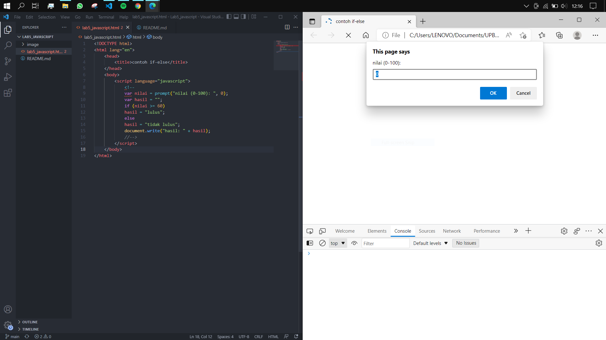 
- Ketika diinput 75, maka hasilnya ``lulus``, jika kurang dari 60 ``tidak lulus`` 
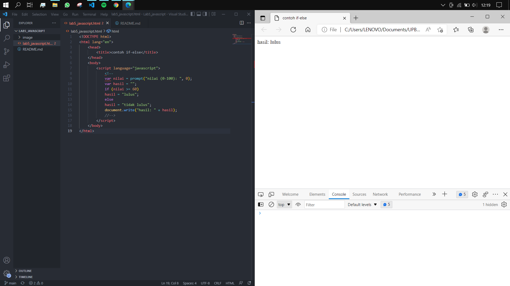 

## <b>8. Seleksi kondisi </b>
- Setelah dijalankan 
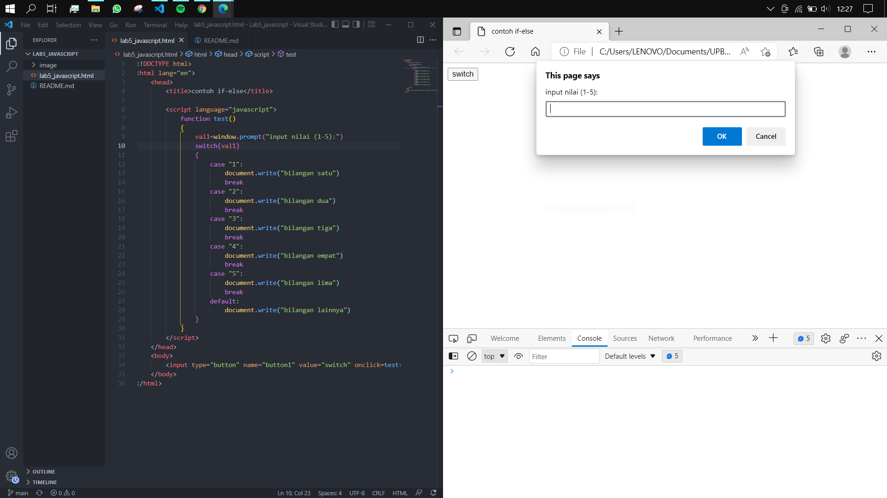 
- Ketika diinput 4 
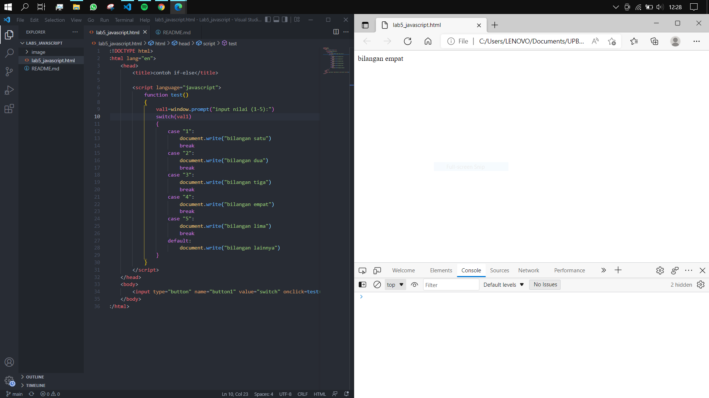 

## <b>9. Form input </b>
- Setelah dijalankan 
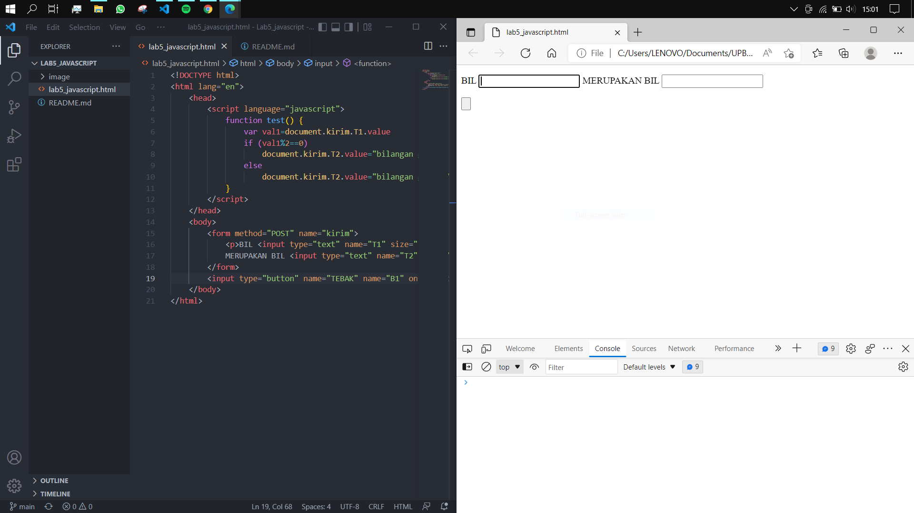 
- Setelah diinput angka 4 
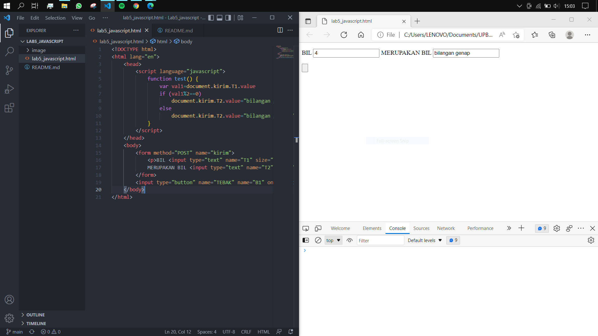 

## <b>10. Form button </b>
- Setelah dijalankan 
 
- Setelah mengklik latar belakang hijau 
 